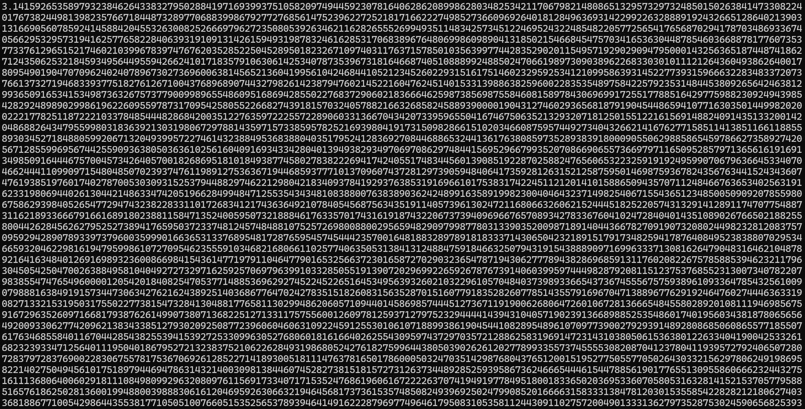

# Calculate Pi
Calculates pi for different formulas used throughout the years.

## Dependencies
- C++
- GMP
- MPFR
- CMake

## Build and Compile
`cmake -S . -B build`  
`cmake --build build`

## About
I wanted to include a variety of formulas used to calculate pi, going back hundreds of years, to what we use today. Here are the equations used by each method, in chronological order.

#### [Madhava-Leibniz Series](src/formulas/leibniz.cpp) (14th Century, 17th Century)

$$\pi = 4\sum_{k=0}^{\infty} \frac{(-1)^k}{2k+1}$$

#### [Wallis Product](src/formulas/wallis.cpp) (1655)

$$\frac{\pi}{2} = \prod_{k=1}^{\infty} \frac{4k^2}{4k^2-1}$$

Solving for $\pi$:

$$\pi = 2\prod_{k=1}^{\infty} \frac{4k^2}{4k^2-1}$$

#### [Euler's Basel Problem Solution](src/formulas/euler.cpp) (1734)

$$\frac{\pi^2}{6} = \sum_{k=1}^{\infty}\frac{1}{k^2}$$

Solving for $\pi$:

$$\pi = \sqrt{6\sum_{k=1}^{\infty}\frac{1}{k^2}}$$

#### [Ramanujan's Series](src/formulas/ramanujan.cpp) (1914)

$$\frac{1}{\pi} = \frac{2\sqrt{2}}{9801} \sum_{k=0}^{\infty} \frac{ (4k)!(1103+26390k) }{ (k!)^4 396^{4k} }$$

Solving for $\pi$:

$$\pi = \frac{9801}{2\sqrt{2}} \left( \sum_{k=0}^{\infty} \frac{ (4k)!(1103+26390k) }{ k!)^4 396^{4k} } \right)^{-1}$$

#### [Chudnovsky Algorithm](src/formulas/chudnovsky.cpp), Original and Rearranged (1988)
$$\frac{1}{\pi} = 12 \sum_{k=0}^{\infty} \frac{ (-1)^k(6k)!(13591409+545140134k) }{ (3k)!(k!)^3(-640320)^{3k+\frac{3}{2}} }$$

Factor out $(-640320)^{3/2}$ and inverse both sides:

$$\pi = \frac{ 426880\sqrt{10005} }{ \displaystyle \sum_{k=0}^{\infty} \frac{ (-1)^k(6k)!\left(13591409+545140134k\right) }{ (3k)!(k!)^3(640320)^{3k} } }$$

## Screenshots

    

